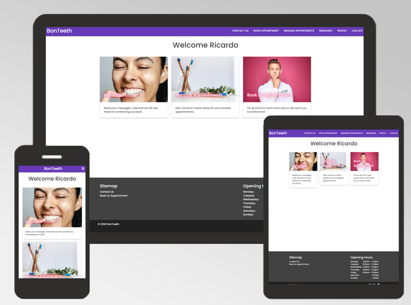
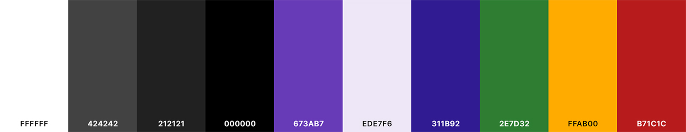
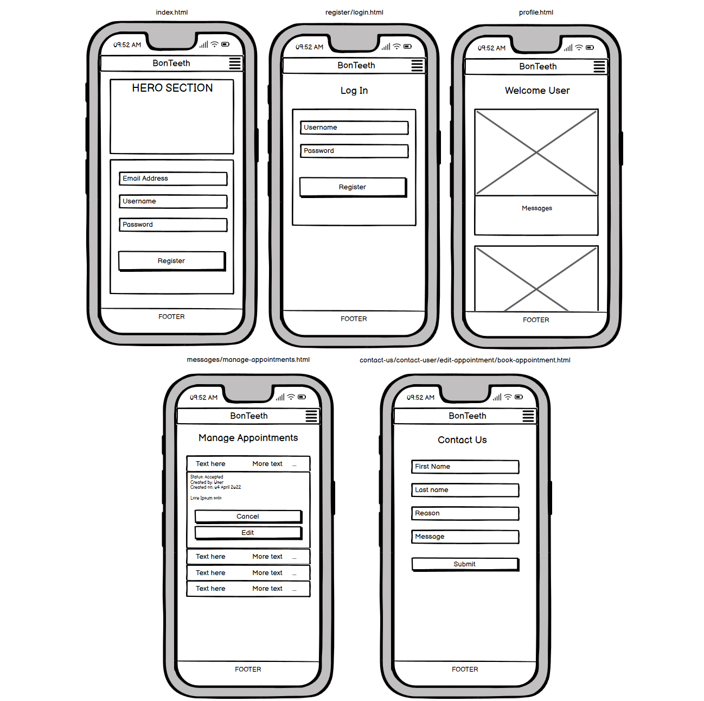
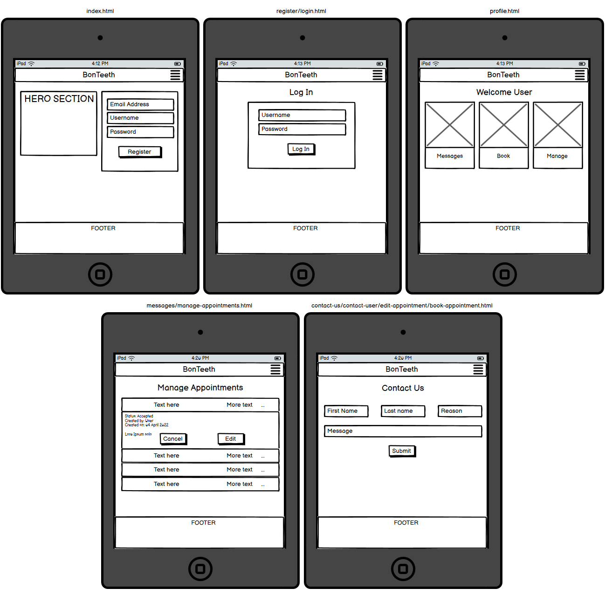
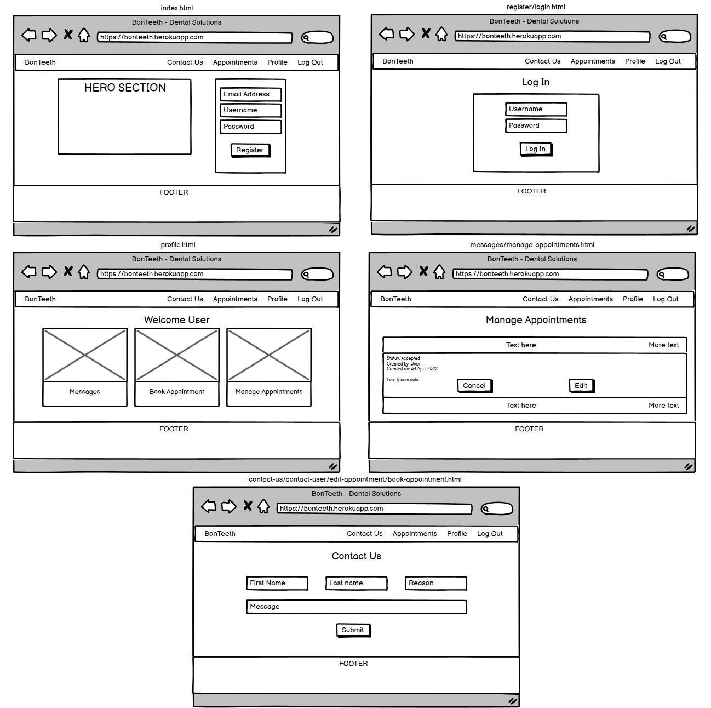
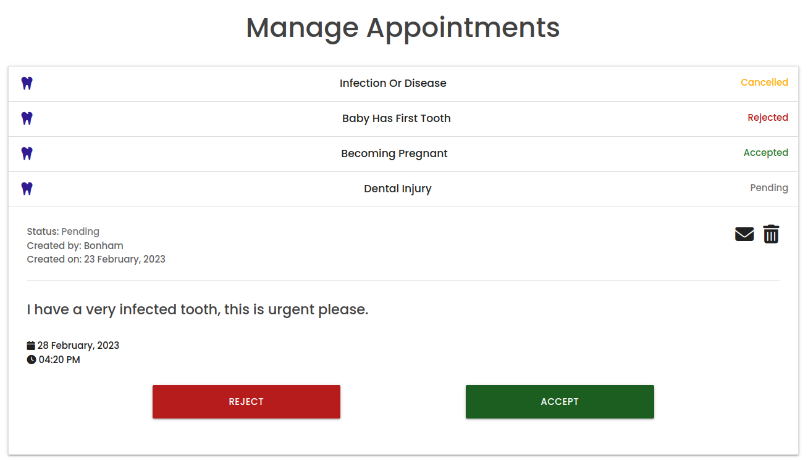
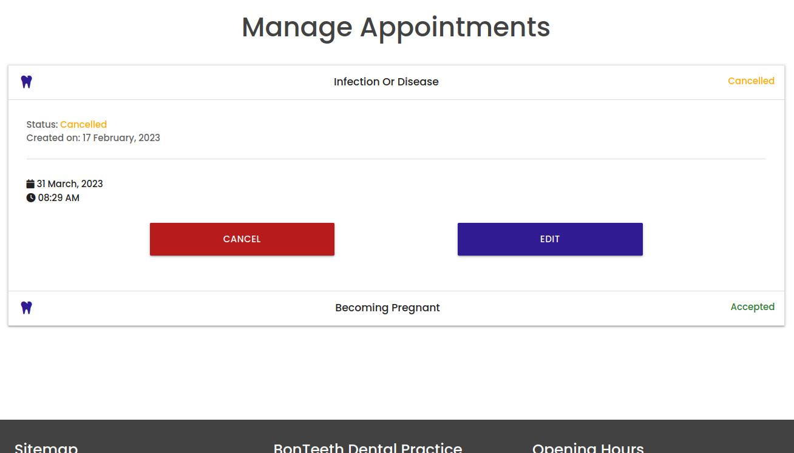

# BonTeeth: Appointment Booking System


## Table of Contents
- BonTeeth: Appointment Booking System.
  - [Table of Contents](#table-of-contents)
  - [1. Description](#1-description)
  - [2. Live project](#2-live-project)
  - [3. UX](#3-ux)
    - [Design](#design)
      - [**Colors**](#colors)
      - [**Fonts**](#fonts)
      - [**Icons**](#icons)
      - [**Imagery**](#imagery)
    - [Wireframes](#wireframes)
      - [**Mobile view**](#mobile-view)
      - [**Tablet view**](#tablet-view)
      - [**Desktop view**](#desktop-view)
    - [User stories](#user-stories)
      - [**First time users**](#first-time-users)
      - [**Returning users**](#returning-users)
      - [**Website owners**](#website-owners)
  - [4. Site Structure](#4-site-structure)
  - [5. Features](#5-features)
    - [Current features](#current-features)
      - [**General features**](#general-features)
      - [**Admin features**](#admin-features)
      - [**Registered Users features**](#registered-users-features)
    - [Future features](#future-features)
  - [6. Technologies used](#6-technologies-used)
    - [Languages](#languages)
    - [Frameworks/Libraries](#frameworkslibraries)
    - [DBMS](#dbms)
    - [Software](#software)
  - [7. Database Structure](#7-database-structure)
    - [MongoDB](#mongodb)
    - [Database Schema](#database-schema)
  - [8. Installation, Development and Deployment](#8-installation-development-and-deployment)
    - [Installation and Development](#installation-and-development)
    - [Deployment](#deployment)
  - [9. Testing](#9-testing)

## 1. Description
BonTeeth is an interactive platform for a local Dental Practice. It offers a booking system where you can book and manage your appointments, also sending or receiving internal messages for customers and staff. It requires authentication for accessing these features, so users need to register or log in. There's two possible scenarios for the usage of this App:

-   Admin (staff): Can view and manage appointment requests. Also read/write messages to customers.
-   Registered Users (customers):  Can book appointments and manage them. Also, can read/write messages to staff.

I've built this App thinking the closest to a Real World Product as possible, even though I've missed a few last features that I plan to implement in the near future.

## 2. Live project
See live project [here](https://bonteeth.herokuapp.com).

## 3. UX
### Design
The design is quite minimalist and colourful where needed.

#### **Colors**
These are the colors I've chosen for my design:


#### **Fonts**
I've chosen [Poppins](https://fonts.google.com/specimen/Poppins) for my design. It's used across entire website and can be found on Google Fonts.

####  **Icons**
All the icons I've used can be found on [FontAwesome](https://fontawesome.com/).

#### **Imagery**
All the images I've used are four in total and can be found on [Unsplash](https://unsplash.com).

### Wireframes
#### **Mobile view**


#### **Tablet view**


#### **Desktop view**


### User stories
#### **First time users**
As a first time user I would like to see:
- Understand the website and its features at first glance.
- Accessible and responsive UI.
- Information about opening times and business location.

#### **Returning users**
As a returning user I would like to see:
- System for contacting dental practice.
- Manage my appointments: cancel or edit them.

#### **Website owners**
As an owner I would like to have:
- System for managing appointments: accepting, rejecting or deleting them.
- System for contacting users upon requested appointment.
- System for booking an appointment for manual testing.

## 4. Site Structure
Website/App consists of ten pages, where some of them are even accessible by non-registered and other pages have different features depending on if you are logged in as regular user or admin:
- **Home (index.html)**
    access allowed for all users, when used by logged-in users you can't see register form.
- **Contact Us (contact-us.html)**
    access allowed for all users, only registered users can see and use the form.
- **Contact User (contact-user.html)**
    access allowed only for admin.
- **Book Appointment (book-appointment.html)**
    access allowed only for registered users and admin, just in case they want to do manual testing for booking system.
- **Edit Appointment (edit-appointment.html)**
    access allowed only for registered users that are not admin.
- **Manage Appointments (manage-appointments.html)**
    access allowed for registered users and available features vary for users and admin.
- **Messages (messages.html)**
    access allowed for registered users and available features vary for users and admin.
- **Profile (profile.html)**
    access allowed for registered users.
- **Register (register.html)**
    access allowed for all users, when used by logged-in users you can't see register form.
- **Login (login.html)**
    access allowed for all users.

## 5. Features
### Current features
#### **General features**
- Accessible and responsive User Interface.
- Authentication system.
- Date formatting for improving User Experience and accessibility.

#### **Admin features**
- Managing system for appointments: accept, reject or delete appointments. Can see all appointments.
- Messaging system for reaching customers when an appointment is booked. Can also delete the messages.



#### **Registered Users features**
- Booking system for appointments.
- Managing system for appointments: edit or cancel appointments. Can see only personal requested appointments.
- Messaging system for reaching staff through Contact Us page.



### Future features
- I've planned to implement a messaging system (Contact Us page) for unregistered users.
- Would like to implement a section for Admin, so they can add/edit/delete "Reasons for Visit" that customers can choose when they book an appointment.

## 6. Technologies used
### Languages
- HTML5
- CSS3
- JavaScript
- Python 3.10
- Jinja templating
- Git

### Frameworks/Libraries
- jQuery
- Flask
- PyMongo
- Materialize CSS

### DBMS
- MongoDB

### Software
- PyCharm
- Visual Studio Code
- Adobe Photoshop CC
- Balsamiq

## 7. Database Structure
### MongoDB
I have chosen to use Non-Relational Database for this project, also known as NoSQL. Specifically I'm using MongoDB as mentioned above.

### Database Schema
I have used four different collections in my Database, each of them are followed by an example for showcasing how data is stored:
- appointments
```
    created_by: "user"
    created_on: "2023-02-20"
    reason_for_visit: "advice"
    requested_date: "2023-03-31"
    requested_time: "08:30 AM"
    additional_information: "here goes the message."
    status: "pending"
```
- messages
```
    sent_by: "john"
    sent_to: "admin"
    sent_on: "2023-02-21"
    first_name: "john"
    last_name: "bonham"
    reason_for_contact: "fees"
    message: "here goes the message."
```
- reason_for_visit
```
    reason: "dental injury"
```
- users
```
    email_address: "john@bonham.com"
    username: "john"
    password: "sha256-encryption"
```

### Password storage
I have used Werkzeug library that comes with Flask for encrypting passwords in a sha256 encryption before storing then into the DBMS.

## 8. Installation, Development and Deployment
### Installation and Development
I have used my own local environment using PyCharm as my IDE. As mentioned above I have used Python 3.10 and on top of it, Flask for routing and rendering HTML templates along with PyMongo and Jinja templating.

### Deployment
I have deployed this website using Heroku platform following these steps:
- When I first created the project folder and set initial boilerplate of files and installed required frameworks/libraries, I've also created "requirements.txt" and "Procfile" files for Heroku in order to declare the dependencies required for website.
- Created App on Heroku and set the config variables from my local "env.py" file.
- Connected my GitHub account to Heroku account and chose the repository of this project. Then I clicked on Deploy and also selected Automatic Deployments from Settings tab.
- Once all this was set up, App started running all OK.

## 9. Testing
You can find all the testing [here](https://github.com/ricocatford/bonteeth-project/blob/master/TESTING.md).
