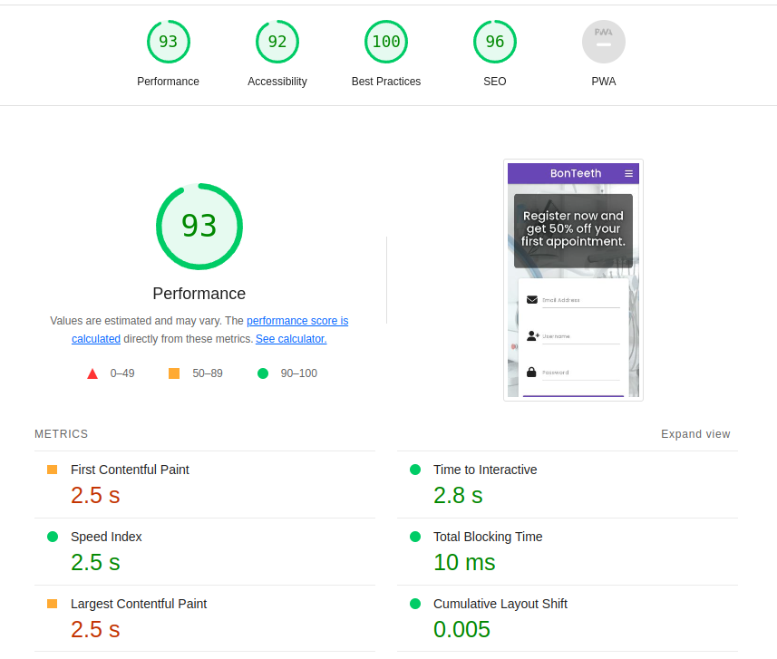
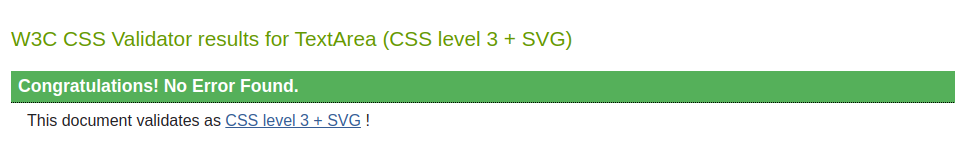
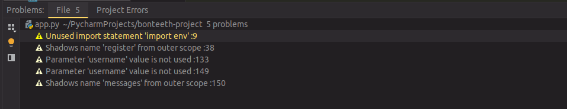

# Testing

## Table of Contents
- [Testing](#testing)
  - [Table of Contents](#table-of-contents)
  - [1. Functionality](#1-functionality)
    - [Navbar](#navbar)
    - [Side Navbar](#side-navbar)
    - [Footer](#footer)
    - [Home page](#home-page)
    - [Home page (while in User session)](#home-page-while-in-user-session)
    - [Contact Us page](#contact-us-page)
    - [Contact Us page (while in User session)](#contact-us-page-while-in-user-session)
    - [Book Appointment page](#book-appointment-page)
    - [Book Appointment page (while in User session)](#book-appointment-page-while-in-user-session)
    - [Manage Appointments page](#manage-appointments-page)
    - [Manage Appointments page (while in User session)](#manage-appointments-page-while-in-user-session)
    - [Manage Appointments page (while in Admin User session)](#manage-appointments-page-while-in-admin-user-session)
    - [Edit Appointment page](#edit-appointment-page)
    - [Edit Appointment page (while in DIFFERENT User session than the one who created the appointment)](#edit-appointment-page-while-in-different-user-session-than-the-one-who-created-the-appointment)
    - [Edit Appointment page (while in User session)](#edit-appointment-page-while-in-user-session)
    - [Messages page](#messages-page)
    - [Messages page (while in User session)](#messages-page-while-in-user-session)
    - [Contact User page](#contact-user-page)
    - [Contact User page (while in Admin User session)](#contact-user-page-while-in-admin-user-session)
    - [Profile page](#profile-page)
    - [Profile page (while in User session)](#profile-page-while-in-user-session)
    - [Log In page](#log-in-page)
    - [Log In page (while in User session)](#log-in-page-while-in-user-session)
    - [Register page](#register-page)
    - [Register page (while in User session)](#register-page-while-in-user-session)
  - [2. Performance](#2-performance)
  - [3. Code validation](#3-code-validation)
    - [HTML validator](#html-validator)
    - [CSS validator](#css-validator)
    - [PyCharm linter](#pycharm-linter)
  - [4. Solved bugs](#4-solved-bugs)
    - [Edit appointment bug](#edit-appointment-bug)
    - [Date format](#date-format)


## 1. Functionality
I've performed regular manual tests throughout development for the usability and performance. Below you can find all
tests performed to the different elements and features of the App. All tests were carried out in Chrome browser which is
my preferred one and the most used nowadays.

### Navbar

| **Element / Feature**        | **Test performed** | **Result**                                               | **Pass / Fail** |
|:-----------------------------|:------------------:|:---------------------------------------------------------|:---------------:|
| **Brand logo**               |      Clicked       | Goes to Home page                                        |    **Pass**     |
| **Contact us link**          |      Clicked       | Goes to Contact Us page                                  |    **Pass**     |
| **Log In link**              |      Clicked       | Goes to Log In page                                      |    **Pass**     |
| **Book Appointment link**    |      Clicked       | Goes to Book an Appointment page                         |    **Pass**     |
| **Manage Appointments link** |      Clicked       | Goes to Manage Appointments page                         |    **Pass**     |
| **Messages link**            |      Clicked       | Goes to Messages page                                    |    **Pass**     |
| **Profile link**             |      Clicked       | Goes to Profile page                                     |    **Pass**     |
| **Log Out link**             |      Clicked       | Removes user from session cookie and goes to Log In page |    **Pass**     |

### Side Navbar
When viewport screen is 992px or smaller, Navbar element is replaced by this 'Side Navbar' appearing from the right of
the screen when clicking 3-bars icon.

| **Element / Feature**        | **Test performed** | **Result**                                               | **Pass / Fail** |
|:-----------------------------|:------------------:|:---------------------------------------------------------|:---------------:|
| **Brand logo**               |      Clicked       | Goes to Home page                                        |    **Pass**     |
| **Contact us link**          |      Clicked       | Goes to Contact Us page                                  |    **Pass**     |
| **Log In link**              |      Clicked       | Goes to Log In page                                      |    **Pass**     |
| **Book Appointment link**    |      Clicked       | Goes to Book an Appointment page                         |    **Pass**     |
| **Manage Appointments link** |      Clicked       | Goes to Manage Appointments page                         |    **Pass**     |
| **Messages link**            |      Clicked       | Goes to Messages page                                    |    **Pass**     |
| **Profile link**             |      Clicked       | Goes to Profile page                                     |    **Pass**     |
| **Log Out link**             |      Clicked       | Removes user from session cookie and goes to Log In page |    **Pass**     |

### Footer

| **Element / Feature**        | **Test performed** | **Result**                                      | **Pass / Fail** |
|:-----------------------------|:------------------:|:------------------------------------------------|:---------------:|
| **Contact us link**          |      Clicked       | Goes to Contact Us page                         |    **Pass**     |
| **Register link**            |      Clicked       | Goes to Register page                           |    **Pass**     |
| **Book Appointment link**    |      Clicked       | Goes to Book an Appointment page                |    **Pass**     |
| **Manage Appointments link** |      Clicked       | Goes to Manage Appointments page                |    **Pass**     |
| **Twitter link**             |      Clicked       | Opens up Twitter website in a new browser tab   |    **Pass**     |
| **Instagram link**           |      Clicked       | Opens up Instagram website in a new browser tab |    **Pass**     |
| **Facebook link**            |      Clicked       | Opens up Facebook website in a new browser tab  |    **Pass**     |

### Home page

| **Element / Feature**    |         **Test performed**          | **Result**                                                      | **Pass / Fail** |
|:-------------------------|:-----------------------------------:|:----------------------------------------------------------------|:---------------:|
| **Hero section heading** |   Resized screen less than 600px    | Not showing anymore                                             |    **Pass**     |
| **Register form**        | Filled up with new user credentials | Creates new user in DB, session cookie and goes to Profile page |    **Pass**     |

### Home page (while in User session)

| **Element / Feature**       | **Test performed** | **Result**           | **Pass / Fail** |
|:----------------------------|:------------------:|:---------------------|:---------------:|
| **Hero section subheading** |    Visited page    | Changes text content |    **Pass**     |
| **Register form**           |    Visited page    | Not showing anymore  |    **Pass**     |

### Contact Us page

| **Element / Feature** | **Test performed** | **Result**            | **Pass / Fail** |
|:----------------------|:------------------:|:----------------------|:---------------:|
| **Paragraph**         |    Visited page    | Changes text content  |    **Pass**     |
| **Sign In link**      |      Clicked       | Goes to Log In page   |    **Pass**     |
| **Register link**     |      Clicked       | Goes to Register page |    **Pass**     |

### Contact Us page (while in User session)

| **Element / Feature** |    **Test performed**    | **Result**                                         | **Pass / Fail** |
|:----------------------|:------------------------:|:---------------------------------------------------|:---------------:|
| **Form**              |     Sent empty form      | Does not allow it                                  |    **Pass**     |
| **Form**              | Sent half-filled up form | Does not allow it                                  |    **Pass**     |
| **Form**              |   Sent filled up form    | Creates new message in DB and goes to Profile page |    **Pass**     |

### Book Appointment page

| **Element / Feature** | **Test performed** | **Result**            | **Pass / Fail** |
|:----------------------|:------------------:|:----------------------|:---------------:|
| **Paragraph**         |    Visited page    | Changes text content  |    **Pass**     |
| **Sign In link**      |      Clicked       | Goes to Log In page   |    **Pass**     |
| **Register link**     |      Clicked       | Goes to Register page |    **Pass**     |

### Book Appointment page (while in User session)

| **Element / Feature** |    **Test performed**    | **Result**                                             | **Pass / Fail** |
|:----------------------|:------------------------:|:-------------------------------------------------------|:---------------:|
| **Form**              |     Sent empty form      | Does not allow it                                      |    **Pass**     |
| **Form**              | Sent half-filled up form | Does not allow it                                      |    **Pass**     |
| **Form**              |   Sent filled up form    | Creates new appointment in DB and goes to Profile page |    **Pass**     |

### Manage Appointments page

| **Element / Feature** | **Test performed** | **Result**            | **Pass / Fail** |
|:----------------------|:------------------:|:----------------------|:---------------:|
| **Paragraph**         |    Visited page    | Changes text content  |    **Pass**     |
| **Sign In link**      |      Clicked       | Goes to Log In page   |    **Pass**     |
| **Register link**     |      Clicked       | Goes to Register page |    **Pass**     |

### Manage Appointments page (while in User session)

| **Element / Feature**               | **Test performed** | **Result**                                                               | **Pass / Fail** |
|:------------------------------------|:------------------:|:-------------------------------------------------------------------------|:---------------:|
| **Whole page**                      |    Visited page    | Only displays appointments list matching current username session cookie |    **Pass**     |
| **Appointments collapsible (list)** |      Clicked       | Expands appointment content                                              |    **Pass**     |
| **Cancel button**                   |      Clicked       | Switches appointment status to 'Cancelled'                               |    **Pass**     |
| **Edit button**                     |      Clicked       | Goes to Edit Appointment page                                            |    **Pass**     |

### Manage Appointments page (while in Admin User session)

| **Element / Feature**               | **Test performed** | **Result**                                | **Pass / Fail** |
|:------------------------------------|:------------------:|:------------------------------------------|:---------------:|
| **Whole page**                      |    Visited page    | Displays all appointments                 |    **Pass**     |
| **Appointments collapsible (list)** |      Clicked       | Expands appointment content               |    **Pass**     |
| **Accept button**                   |      Clicked       | Switches appointment status to 'Accepted' |    **Pass**     |
| **Reject button**                   |      Clicked       | Switches appointment status to 'Rejected' |    **Pass**     |
| **Envelope icon**                   |      Clicked       | Goes to Contact User page                 |    **Pass**     |
| **Trash can icon**                  |      Clicked       | Deletes appointment in DB                 |    **Pass**     |

### Edit Appointment page

| **Element / Feature** |               **Test performed**                | **Result**                                 | **Pass / Fail** |
|:----------------------|:-----------------------------------------------:|:-------------------------------------------|:---------------:|
| **Whole page**        | Tried to enter by appointment ID in the URL bar | Does not show form for this appointment ID |    **Pass**     |

### Edit Appointment page (while in DIFFERENT User session than the one who created the appointment)

| **Element / Feature** |               **Test performed**                | **Result**                                 | **Pass / Fail** |
|:----------------------|:-----------------------------------------------:|:-------------------------------------------|:---------------:|
| **Whole page**        | Tried to enter by appointment ID in the URL bar | Does not show form for this appointment ID |    **Pass**     |

### Edit Appointment page (while in User session)

| **Element / Feature** |                 **Test performed**                  | **Result**                | **Pass / Fail** |
|:----------------------|:---------------------------------------------------:|:--------------------------|:---------------:|
| **Form**              | Changed some values in already existing appointment | Updates appointment in DB |    **Pass**     |

### Messages page

| **Element / Feature** |        **Test performed**         | **Result**                                   | **Pass / Fail** |
|:----------------------|:---------------------------------:|:---------------------------------------------|:---------------:|
| **Whole page**        | Visited page of existing username | Does not show the existing username messages |    **Pass**     |

### Messages page (while in User session)

| **Element / Feature**           | **Test performed** | **Result**                                                           | **Pass / Fail** |
|:--------------------------------|:------------------:|:---------------------------------------------------------------------|:---------------:|
| **Whole page**                  |    Visited page    | Only displays messages list matching current username session cookie |    **Pass**     |
| **Messages collapsible (list)** |      Clicked       | Expands message content                                              |    **Pass**     |

### Contact User page

| **Element / Feature** |               **Test performed**                | **Result**                                   | **Pass / Fail** |
|:----------------------|:-----------------------------------------------:|:---------------------------------------------|:---------------:|
| **Whole page**        | Tried to enter by appointment ID in the URL bar | Does not show form unless you are Admin User |    **Pass**     |

### Contact User page (while in Admin User session)

| **Element / Feature** | **Test performed**  | **Result**                                         | **Pass / Fail** |
|:----------------------|:-------------------:|:---------------------------------------------------|:---------------:|
| **Form**              |   Sent empty form   | Does not allow it                                  |    **Pass**     |
| **Form**              | Sent filled up form | Creates new message in DB and goes to Profile page |    **Pass**     |

### Profile page

| **Element / Feature** |        **Test performed**         | **Result**                     | **Pass / Fail** |
|:----------------------|:---------------------------------:|:-------------------------------|:---------------:|
| **Whole page**        | Visited page of existing username | Displays Internal Server Error |    **Pass**     |

### Profile page (while in User session)

| **Element / Feature**               | **Test performed** | **Result**                       | **Pass / Fail** |
|:------------------------------------|:------------------:|:---------------------------------|:---------------:|
| **Heading**                         |    Visited page    | Displays correct username        |    **Pass**     |
| **Messages card (link)**            |      Clicked       | Goes to Messages page            |    **Pass**     |
| **Manage Appointments card (link)** |      Clicked       | Goes to Manage Appointments page |    **Pass**     |
| **Book an Appointment card (link)** |      Clicked       | Goes to Book Appointment page    |    **Pass**     |

### Log In page

| **Element / Feature** |          **Test performed**          | **Result**                                           | **Pass / Fail** |
|:----------------------|:------------------------------------:|:-----------------------------------------------------|:---------------:|
| **Form**              | Filled up with incorrect credentials | Does not allow you to log in and flashes message     |    **Pass**     |
| **Form**              |  Filled up with correct credentials  | Creates User session cookie and goes to Profile page |    **Pass**     |

### Log In page (while in User session)

| **Element / Feature** | **Test performed** | **Result**                        | **Pass / Fail** |
|:----------------------|:------------------:|:----------------------------------|:---------------:|
| **Whole page**        |    Visited page    | Does not show Log in form anymore |    **Pass**     |
| **Paragraph**         |    Visited page    | Says you are already logged in    |    **Pass**     |

### Register page

| **Element / Feature** |              **Test performed**               | **Result**                                                      | **Pass / Fail** |
|:----------------------|:---------------------------------------------:|:----------------------------------------------------------------|:---------------:|
| **Form**              | Filled up with already existing email address | Does not allow you to register and flashes message              |    **Pass**     |
| **Form**              |      Filled up already existing username      | Does not allow you to register and flashes message              |    **Pass**     |
| **Form**              |      Filled up with new user credentials      | Creates new user in DB, session cookie and goes to Profile page |    **Pass**     |

### Register page (while in User session)

| **Element / Feature** | **Test performed** | **Result**                          | **Pass / Fail** |
|:----------------------|:------------------:|:------------------------------------|:---------------:|
| **Whole page**        |    Visited page    | Does not show Register form anymore |    **Pass**     |
| **Paragraph**         |    Visited page    | Says you are already logged in      |    **Pass**     |

I also tested responsive design and performance for different browsers including all OS (Windows, Mac and Linux) without
any major problems found, in these other browsers:
- Microsoft Edge
- Firefox
- Safari

## 2. Performance
I used Lighthouse extension for Chrome developer tools for testing the performance of the website:


## 3. Code validation
### HTML validator
Tested all the HTML code with [W3C markup validator](https://validator.w3.org/) and only found errors and warnings due
to Jinja templating, required for Flask.

### CSS validator
Tested all my custom CSS code with [W3C jigsaw validator](https://jigsaw.w3.org/css-validator/) and no errors found,
only one warning for ``@import`` on line 1:


### PyCharm linter
Before releasing last version of this website, all warnings and errors found in PyCharm linter for "app.py" in order to
be PEP8 compliant were solved. Still, there's a few I could not fix:


## 4. Solved bugs
### Edit appointment bug
There was an important security breach where other user could edit any appointment if accessing it by ObjectId. I had to
implement this piece of code into edit-appointments.html on line 16 to fix it:
```
 
```
And of course, close the condition on line 92 with:
```
 
```

### Date format
One thing I really needed to fix and was not a real bug, was displaying the date in a human-friendly way. Since I was
using ``date.today()``, built-in Python function to store the "created_on" field for appointments and "sent_on" for
messages and the format goes like: 2023-01-01. Then I thought it might be confusing for the user to guess what was day
or month, therefore I decided to implement this function in order to solve this issue:
```
def format_date(datetime_string):
    formatted_datetime = datetime.strptime(datetime_string, "%Y-%m-%d")
    return formatted_datetime.strftime("%d %B, %Y")
```
This function is used inside these two other functions ``manage_appointments()`` and ``messages()`` for rendering the
time to a format like: 01 January, 2023.